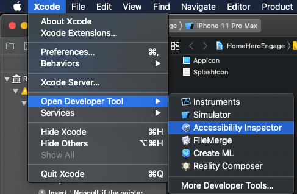
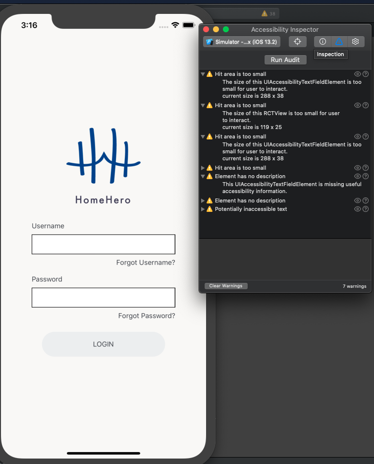

# Testing Accessibility - iOS

To test on iOS you must utilize the Accessibility Inspector Developer Tool that is bundled with Xcode.  This can be found from within the Xcode menu when the app is open or from applications by opening the inspector directly.

Once the app is running, on a simulator you will connect the inspector tools to the device you wish to inspect, it will default to your Mac. Once you’ve selected the simulator, click on the target icon right beside the drop-down. This activates the inspection mode. You can also run an audit which will  provide you with errors and warnings found. In addition you can play the voice over screen reader feature and it will go through your screen as if you were utilizing that feature and find gaps or where you might not like what is being read to the user, where more description is needed, etc.

**_NOTE:_** According to the official [React Native docs](https://www.notion.so/echobind/Testing-iOS-830dd439b49e4fd8a767fed58be4935a#fad37069421848f7b20139c4287b089e), testing VoiceOver not supported on Simulator- however use the inspector as mentioned.